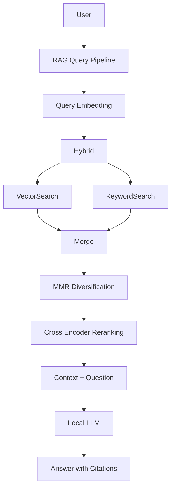
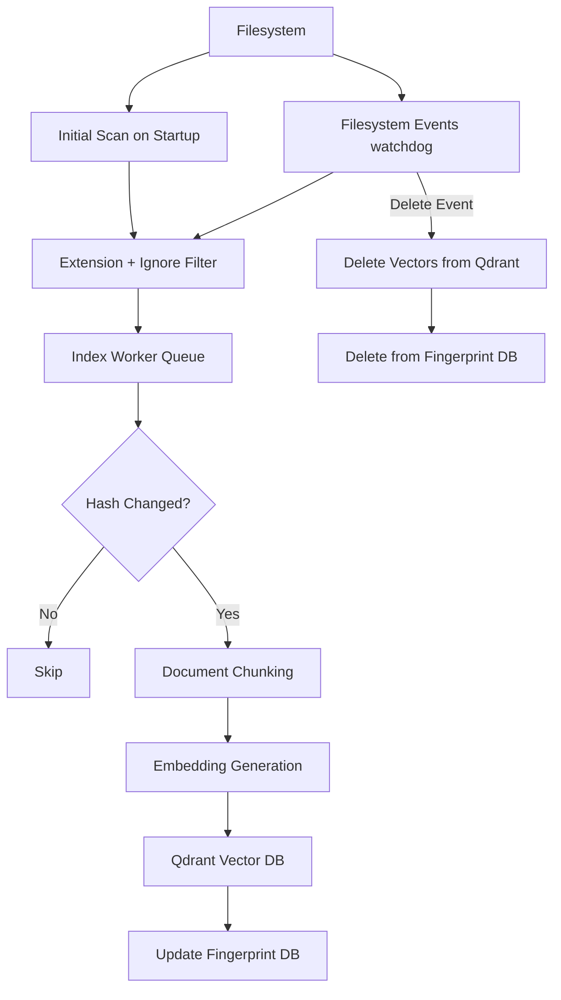

# Local AI / RAG System

A **self‑hosted AI knowledge system** designed to run entirely on a
local machine or private network.\
It combines **local LLM inference, document chunking, hybrid retrieval,
reranking, and vector search** to enable semantic search and AI‑assisted
answers over locally indexed documents.

This project is designed for **private AI infrastructure** where
documents, models, and embeddings remain fully under the operator's
control.

------------------------------------------------------------------------

# Overview

This system enables:

-   Running local large language models
-   Generating embeddings for semantic search
-   Storing vectors in a local vector database
-   Incremental indexing via SHA-256 file fingerprinting
-   Hybrid retrieval (vector + keyword)
-   Cross‑encoder reranking
-   Filesystem watching for automatic re‑indexing

------------------------------------------------------------------------

# Query Pipeline



------------------------------------------------------------------------

# Ingestion Pipeline



The ingestion pipeline supports:

-   incremental indexing
-   automatic updates
-   deletion tracking
-   file fingerprinting

------------------------------------------------------------------------

# Project Structure

    rag-system/
    ├── api/
    │   ├── embed.py             ← shared embedding helper (ingest + retrieval)
    │   ├── ollama_client.py     ← shared Ollama HTTP session
    │   ├── query_rag.py
    │   ├── retrieval.py
    │   └── keyword_index.py
    │
    ├── ingest/
    │   ├── chunkers.py
    │   ├── cleanup_stale.py
    │   ├── index_documents.py
    │   └── reset_collection.py
    │
    ├── indexer/
    │   ├── watcher.py
    │   └── fingerprint_store.py
    │
    ├── common/
    │   ├── paths.py             ← shared path/filter helpers
    │   └── sqlite_store.py      ← shared SQLite connection helper
    │
    ├── config/
    │   └── watcher_config.container.yaml ← Docker paths (/watch/…)
    │
    ├── data/
    │   ├── fingerprints.sqlite3
    │   └── users.sqlite3            ← web UI user credentials
    │
    ├── scripts/
    │   └── smoke_rag.py             ← end-to-end smoke test (requires live services)
    │
    ├── tests/
    │   ├── conftest.py              ← session-wide mocks for unit tests
    │   ├── test_auth.py
    │   ├── test_chunking.py
    │   ├── test_paths.py
    │   ├── test_request_validation.py
    │   ├── test_retrieval.py
    │   └── integration/
    │       └── test_reindexing.py   ← requires live Qdrant
    │
    ├── web/
    │   ├── api_server.py            ← app creation, routes, lifespan
    │   ├── auth.py                  ← token validation (API key + session)
    │   ├── rate_limit.py            ← sliding-window rate limiter
    │   ├── schemas.py               ← Pydantic request/response models
    │   ├── openai_compat.py         ← SSE and OpenAI response formatting
    │   ├── user_store.py            ← SQLite-backed user store
    │   └── index.html               ← built-in chat UI
    │
    ├── manage_users.py              ← CLI for adding/removing web UI users
    │
    ├── Dockerfile
    ├── docker-compose.yml           ← full stack (Qdrant + API + watcher)
    ├── .dockerignore
    ├── pyproject.toml
    ├── uv.lock
    ├── settings.py
    └── README.md

------------------------------------------------------------------------

# Requirements

-   [Docker Desktop](https://www.docker.com/products/docker-desktop/) (Windows, macOS, or Linux)
-   [Ollama](https://ollama.com) installed and running on the host

------------------------------------------------------------------------

# Docker Deployment

Qdrant, the API server, and the filesystem watcher run in Docker.
Ollama runs on the host for native GPU access — install it from
[ollama.com](https://ollama.com) and make sure it is running before
starting the stack. Works on Windows, macOS, and Linux.

## Prerequisites

-   [Docker Desktop](https://www.docker.com/products/docker-desktop/) (Windows/macOS)
    or Docker Engine (Linux)
-   [Ollama](https://ollama.com) installed and running on the host

## 1. Configure the filesystem watcher

The watcher monitors directories for documents to index. You need to:

**a) Update `config/watcher_config.container.yaml`** to list the paths
you want indexed. Use the container-side mount paths (`/watch/…`):

    watch_paths:
      - path: /watch/Nextcloud
        recursive: true
      - path: /watch/Code
        recursive: true

**b) Copy `.env.example` to `.env`** and set your host paths:

    # Windows
    NEXTCLOUD_PATH=C:/Users/YourName/Nextcloud
    CODE_PATH=C:/Users/YourName/Code

    # Linux / macOS
    NEXTCLOUD_PATH=/home/yourname/Nextcloud
    CODE_PATH=/home/yourname/Code

Set a Qdrant API key. This is required by `docker-compose.yml` so the vector
database is not accessible unauthenticated from other containers on the Docker
network:

    QDRANT_API_KEY=<generate with: openssl rand -hex 32>

If the API is exposed beyond localhost (e.g. behind a reverse proxy), set an API key:

    API_KEY=<generate with: openssl rand -hex 32>

When `API_KEY` is set, all endpoints except `GET /` require the header:

    Authorization: Bearer <your-key>

Leave `API_KEY` empty only if you explicitly opt into local-only insecure mode:

    ALLOW_INSECURE_LOCALONLY=true

The built-in web UI uses session-based authentication — no signing secret is needed.
Optionally set the session lifetime (default 8 hours):

    SESSION_EXPIRY_HOURS=8

By default, `CORS_ORIGINS` is empty. Set it only when you need browser access from a
different origin:

    CORS_ORIGINS=https://chat.example.com,https://app.example.com

If the API runs behind a reverse proxy, set `TRUSTED_PROXY_IPS` to the proxy's IP so
that `X-Forwarded-For` is used for rate-limiting instead of the proxy address:

    TRUSTED_PROXY_IPS=192.168.1.1

## 2. Pull Ollama models

The embedding model is required. Pull it before starting the stack:

    ollama pull nomic-embed-text

Then pull whichever generation model(s) you want to use for chat and Q&A:

    ollama pull qwen2.5:14b        # default GEN_MODEL
    ollama pull llama3.1:8b
    ollama pull qwen2.5-coder:14b

Any model available in Ollama can be selected per-request; see the [Models](#models) section.

## 3. Start the stack

    docker compose up -d

This builds one shared `rag-system:latest` image, then starts three containers:
`rag-qdrant`, `rag-api`, and `rag-watcher`. The API and watcher containers run
the same image with different commands.

## 4. Verify

    docker compose ps

All three services should show status `running`.

    curl http://localhost:8000/healthz

Expected: `{"status":"ok"}`

## Logs

    docker compose logs -f api
    docker compose logs -f watcher

## Stopping

    docker compose down

All data persists in Docker named volumes (`qdrant-storage`, `rag-data`, `hf-cache`).

------------------------------------------------------------------------

# Models

Pull any models you want to use into Ollama — the API server exposes them
all via `/v1/models` and clients can select freely per request.

    curl http://localhost:8000/v1/models

`GEN_MODEL` in `settings.py` (default: `qwen2.5:14b`) is used only as a
fallback when Ollama cannot be reached at startup.

------------------------------------------------------------------------

# Query Modes

| Mode | Behavior |
| --- | --- |
| `strict` | Answers only from retrieved context. If no relevant chunks are found, returns a "no context found" message rather than guessing. |
| `augmented` | Uses retrieved context when available and cites it. Supplements with the model's own knowledge where the context is incomplete. Falls back to a direct model response if no context is found at all. |

**Per-request switching (web UI):** The built-in chat UI has an
Augmented / Strict dropdown in the header. Each request sends the
selected mode — no restart required, and different conversations can
use different modes simultaneously.

**Per-request switching (API clients):** Pass `rag_mode` in the request body:

    POST /v1/chat/completions
    {"model": "...", "messages": [...], "rag_mode": "strict"}

**Server-side default:** `RAG_MODE` in `.env` sets the fallback used
when a request omits `rag_mode`. Defaults to `augmented`.

    RAG_MODE=augmented   # default — model fills gaps with its own knowledge
    RAG_MODE=strict      # grounded answers from indexed documents only

Only `strict` and `augmented` are valid. The server refuses to start if
`RAG_MODE` is set to any other value.

**When to use each:**

- **`augmented`** (default) is useful when you want the model to remain
  helpful even on questions your documents don't fully cover. Answers
  may blend document content with the model's training data.
- **`strict`** ensures every answer traces back to an indexed document.
  The model will not invent details not present in the context.

------------------------------------------------------------------------

# Performance Tuning

All tuning variables are set in `.env` and take effect after restarting
the relevant container (`api` or `watcher`).

## Retrieval and observability

| Variable | Default | Description |
| --- | --- | --- |
| `RAG_TIMING` | `0` | Set to `1` to log per-stage timings (embed, recall, rerank, generate) on every request |
| `MMR_ENABLED` | `true` | Set to `false` to skip MMR diversification; reduces payload size and CPU work |
| `RECALL_K` | `15` | Number of candidates fetched from Qdrant and BM25 before reranking |
| `MMR_K` | `12` | Number of candidates kept after MMR diversification |
| `FINAL_K` | `4` | Number of chunks passed to the LLM after reranking |
| `MMR_LAMBDA_MULT` | `0.7` | MMR trade-off: 1.0 = pure relevance, 0.0 = pure diversity |
| `KEYWORD_REFRESH_INTERVAL` | `30` | Seconds between cheap checks for watcher-indexed changes; BM25 rebuilds only when indexed content changed |

Enable timing to identify which pipeline stage dominates latency:

    RAG_TIMING=1 docker compose up -d api
    docker compose logs -f api   # look for embed/recall/rerank/generate lines

## API concurrency and rate limiting

| Variable | Default | Description |
| --- | --- | --- |
| `RAG_EXECUTOR_WORKERS` | `4` | Thread pool size for RAG pipeline execution |
| `RAG_CONCURRENCY_LIMIT` | `4` | Max simultaneous in-flight RAG requests |
| `RATE_WINDOW_SECONDS` | `60` | Sliding window duration for rate limiting |
| `RATE_MAX_REQUESTS` | `30` | Max general API requests per IP per window |
| `RATE_MAX_LOGIN_REQUESTS` | `10` | Max login attempts per IP per window |
| `STREAM_TIMEOUT_SECONDS` | `120` | Seconds to wait for each streaming chunk before timing out |

## Ollama generation

| Variable | Default | Description |
| --- | --- | --- |
| `OLLAMA_NUM_CTX` | `16384` | Context window size passed to Ollama for generation |
| `RAG_REQUEST_TIMEOUT_SECONDS` | `240` | Total time budget for a RAG request (semaphore wait + pipeline + generation) |
| `OLLAMA_GENERATE_TIMEOUT_SECONDS` | `120` | Timeout for streaming generation calls to Ollama |
| `OLLAMA_EMBED_TIMEOUT_SECONDS` | `60` | Timeout for embedding calls to Ollama |
| `OLLAMA_MODEL_LIST_TIMEOUT_SECONDS` | `5` | Timeout for the `/api/tags` model list call |
| `OLLAMA_WARMUP_TIMEOUT_SECONDS` | `60` | Timeout for the startup warmup call to Ollama |
| `WARM_MODELS_ON_STARTUP` | `false` | Set to `true` to warm the LLM, embedding model, and reranker when the API starts |

------------------------------------------------------------------------

# Document Ingestion

Manual indexing

    docker exec rag-api python ingest/index_documents.py

Reset collection (also clears the fingerprint store so the watcher re-indexes from scratch)

    docker exec rag-api python ingest/reset_collection.py

To delete vectors only and leave fingerprints intact:

    docker exec rag-api python ingest/reset_collection.py --vectors-only

------------------------------------------------------------------------

# Filesystem Watcher

The watcher uses `watchdog`'s `PollingObserver`, which polls the filesystem on a
configurable interval (default 30 seconds, set via `WATCHER_POLL_INTERVAL_SECONDS`).
This ensures reliable detection of new and modified files on all platforms, including
WSL2-mounted Windows paths (`/mnt/c/...`) where kernel inotify events are not delivered.

The watcher reads `config/watcher_config.container.yaml`, set via the
`CONFIG_PATH` environment variable in `docker-compose.yml`. Paths use the
`/watch` prefix because host directories are bind-mounted into the container
under `/watch` (e.g. `${NEXTCLOUD_PATH}:/watch/Nextcloud:ro`).

Example container config:

    watch_paths:
      - path: /watch/Nextcloud
        recursive: true
      - path: /watch/Code
        recursive: true
        exclude_dirs:
          - .git
          - .venv
          - __pycache__
          - node_modules
          - build
          - dist

    allowed_extensions:
      - .md
      - .txt
      - .py
      - .js
      - .ts
      - .go
      - .rs
      # see watcher_config.container.yaml for the full list
      # config/script extensions such as .yaml, .json, .toml, .ini,
      # .cfg, .sql, and .sh are intentionally excluded by default

    ignore_patterns:
      - .git
      - node_modules
      - __pycache__
      - .env
      - .ssh
      - "*.pem"
      - "*secret*"

**`exclude_dirs` vs `ignore_patterns`:** `ignore_patterns` filters which files get
*indexed* — it does not stop `PollingObserver` from walking those directories on
every poll tick. If a watch path contains large non-code trees (`.venv`, `.git`,
`node_modules`, build artifacts), the observer will still stat every file inside
them, causing sustained CPU load proportional to the total file count. Use
`exclude_dirs` on those watch path entries to prune the polling walk itself.
`ignore_patterns` remains useful for file-level filtering (e.g. `*.pem`,
`*secret*`) where directory pruning is not enough.

------------------------------------------------------------------------

# API Server

`web/api_server.py` exposes an OpenAI-compatible REST API so any
OpenAI-compatible client can query the local knowledge base.

Endpoints

| Method | Path | Description |
| --- | --- | --- |
| `GET` | `/healthz` | Container health check |
| `GET` | `/` | Redirects to `/ui/` when authenticated; protected like the API |
| `GET` | `/ui/` | Built-in web chat UI assets (no auth required to load) |
| `POST` | `/auth/login` | Exchange username/password for an HttpOnly session cookie |
| `POST` | `/auth/logout` | Clear the browser session cookie |
| `GET` | `/v1/models` | List available models |
| `GET` | `/models` | Alias for `/v1/models` |
| `POST` | `/v1/chat/completions` | RAG-backed chat completion (supports `"stream": true`) |
| `POST` | `/chat/completions` | Alias for `/v1/chat/completions` |

------------------------------------------------------------------------

# Web UI

A built-in chat interface is served at `/ui/` directly from the `rag-api`
container. No extra container or build step required. Static browser assets
are served from `web/static/` only, so backend Python modules are not exposed
under `/ui/`. Markdown rendering uses vendored copies of `marked.js` and
`DOMPurify` — no internet access required at runtime.

## Setup

**1. Add users** via the management CLI:

    docker exec -it rag-api python manage_users.py add <username>
    # prompts for password, bcrypt-hashes it, writes to data/users.sqlite3

Other commands:

    docker exec -it rag-api python manage_users.py list
    docker exec -it rag-api python manage_users.py remove <username>

User changes take effect immediately — no container restart needed.
Removing a user invalidates their active session on the next request.

## Accessing the UI

| Environment | URL |
| --- | --- |
| Local | `http://localhost:8000/ui/` |
| Behind reverse proxy | `https://<your-domain>/ui/` |

Log in with the username and password set via `manage_users.py`. The UI
sets an HttpOnly session cookie (default 8-hour expiry, configurable via
`SESSION_EXPIRY_HOURS`). Browser JavaScript cannot read this cookie; the browser
sends it automatically on same-origin API requests. When it expires, the login
form reappears automatically. Logging out immediately invalidates the session.

Machine clients (`API_KEY` bearer token) are unaffected — both auth
mechanisms work simultaneously.

------------------------------------------------------------------------

# Chat Clients

Any OpenAI-compatible chat client can connect to the API server.
Point the client at `http://<host>:8000`. The model list is populated
dynamically from `GET /v1/models` — select any model already pulled in
Ollama.

Recommended clients:

| Client | Notes |
| --- | --- |
| **Open WebUI** | Full-featured web UI, runs in Docker |
| **Chatbox** | Desktop app for macOS, Windows, Linux |
| **LangChain** | Programmatic access via `ChatOpenAI` |

Open WebUI quick start

    docker run -d -p 3000:8080 \
      -e OPENAI_API_BASE_URL=http://host.docker.internal:8000/v1 \
      -e OPENAI_API_KEY=<your API_KEY> \
      ghcr.io/open-webui/open-webui:main

Chatbox configuration

-   API Mode: OpenAI API
-   API Host: `http://localhost:8000` (or your remote URL)
-   API Key: the value of `API_KEY` from your `.env` (any non-empty string if auth is disabled)
-   Model: select from the list populated by `/v1/models`

------------------------------------------------------------------------

# Performance Notes

The query pipeline runs these stages in sequence:

1.  Query embedding (Ollama)
2.  Hybrid recall — Qdrant vector search + BM25 keyword search
3.  Deduplication by point ID
4.  MMR diversification (optional, see `MMR_ENABLED`)
5.  Cross-encoder reranking (CPU)
6.  Prompt assembly and LLM generation (Ollama, streamed)

Implemented latency improvements:

| Change | Effect |
| --- | --- |
| True Ollama streaming | First token delivered as generation starts, not after full completion |
| Shared HTTP session | TCP connections to Ollama reused across embed and generate calls |
| BM25 `heapq.nlargest` | Partial top-k sort replaces full O(n log n) sort on every query |
| Zero-score BM25 filter | Irrelevant keyword results excluded before reranking |
| Candidate deduplication | Vector and keyword overlap removed before cross-encoder |
| Reduced default candidate counts | recall\_k 30→15, mmr\_k 10→8, final\_k 6→4 |
| Optional MMR disable | `MMR_ENABLED=false` skips vector fetch and cosine work entirely |
| Per-stage timing | `RAG_TIMING=1` logs each stage's wall time for profiling |

------------------------------------------------------------------------

# Hardware Notes

> **These notes are specific to one hardware configuration (GMKtec NUCBox
> with AMD Radeon integrated graphics). Your GPU vendor, driver stack, and
> required steps will differ.**

## AMD Radeon iGPU on Windows (Vulkan backend)

By default, Ollama on Windows attempts to use AMD GPUs via the ROCm/HIP
backend. For discrete AMD GPUs (RX 6000/7000 series, etc.) this works
after installing the AMD HIP SDK. However, **AMD integrated GPUs (iGPUs)
found in Ryzen APUs are not supported by ROCm** — Ollama will detect the
device and then silently fall back to CPU.

The fix is to use Ollama's Vulkan backend instead. AMD has broad Vulkan
support across all GPU families including iGPUs.

### Steps

1.  Install the [AMD HIP SDK for Windows](https://www.amd.com/en/developer/rocm-hub/hip-sdk.html)
    (required even for the Vulkan path — Ollama's discovery process uses it)

2.  Set `OLLAMA_VULKAN=1` as a persistent Windows environment variable:

    ```powershell
    # In PowerShell (no admin required)
    [System.Environment]::SetEnvironmentVariable("OLLAMA_VULKAN", "1", "User")
    ```

3.  Fully quit and restart Ollama (right-click tray icon → Quit, then relaunch)

4.  Verify GPU is active:

    ```powershell
    ollama run llama3.1:8b --keepalive 2m
    # in a second terminal:
    ollama ps
    # should show: 100% GPU
    ```

### Why this works

Without `OLLAMA_VULKAN=1`, Ollama probes ROCm first and logs
`"filtering device which didn't fully initialize"` for iGPU targets like
`gfx1035`. With Vulkan enabled, the iGPU is enumerated correctly and all
available system memory shared with the GPU is visible to Ollama.

### Notes

-   AMD APUs use shared system RAM as VRAM. The amount visible to Ollama
    will be larger than the dedicated GPU memory reported by Windows
    (typically equal to total system RAM minus OS overhead).
-   This was tested on Ollama 0.23.1 with ROCm 7.1 on Windows 11.
    Future Ollama versions may add native iGPU support and make this
    unnecessary.
-   Other GPU vendors (NVIDIA, Intel Arc) have their own acceleration
    paths and do not need `OLLAMA_VULKAN=1`.

------------------------------------------------------------------------

# Developer Guide

## Local Setup

Dependencies are managed with [uv](https://github.com/astral-sh/uv). Install
it once, then sync the project:

    pip install uv
    uv sync          # installs runtime deps into .venv
    uv sync --dev    # also installs pytest, ruff

The Docker image uses the same `uv.lock` for reproducible builds.

## Running Tests

Unit tests run without Qdrant or Ollama:

    .venv/bin/python -m pytest tests/ -m "not integration" -q

Integration tests require a live Qdrant instance (skipped automatically
if unavailable):

    .venv/bin/python -m pytest tests/ -m integration -q

End-to-end smoke test (requires both Qdrant and Ollama):

    .venv/bin/python scripts/smoke_rag.py

Lint:

    .venv/bin/python -m ruff check .

------------------------------------------------------------------------

## Adding New Chunking Strategies

Chunkers live in:

    ingest/chunkers.py

Example extension:

    def chunk_json(text):
        ...

Register in dispatcher:

    if suffix == ".json":
        return chunk_json(text)

------------------------------------------------------------------------

## Adding a Retrieval Strategy

Edit

    api/retrieval.py

Examples:

-   hybrid retrieval
-   graph retrieval
-   reranking models

------------------------------------------------------------------------

## Adding New Index Sources

Modify

    config/watcher_config.container.yaml

Example:

    watch_paths:
      - path: /watch/Research
        recursive: true

------------------------------------------------------------------------

# Security Model

Local‑first architecture:

-   models run locally
-   vector database local
-   documents never leave machine

Runtime controls:

| Control | Detail |
| --- | --- |
| API key auth | Set `API_KEY` in `.env`. Protected API endpoints accept `Authorization: Bearer <key>` and compare it with `hmac.compare_digest` (timing-safe). Exempt paths are `/healthz`, `/favicon.ico`, `/ui/*`, `/auth/login`, and `/auth/logout`. |
| Web UI auth | Browser users log in with username/password; server creates an opaque session token stored in `data/users.sqlite3` and sets an HttpOnly cookie. No signing secret required. Session lifetime is configurable via `SESSION_EXPIRY_HOURS` (default 8 hours). Logout immediately revokes the session. Credentials are stored as bcrypt hashes. |
| Auth disabled local mode | Startup succeeds without any auth unless `ALLOW_INSECURE_LOCALONLY=true` is set; all non-exempt endpoints return 401 by default. Set `ALLOW_INSECURE_LOCALONLY=true` only for local development. |
| Rate limiting | General API requests are limited to 30 requests per minute per IP. `/auth/login` uses a separate tighter 10 attempts per minute per-IP bucket. Returns `429` when exceeded. |
| Trusted proxy IPs | Set `TRUSTED_PROXY_IPS` (comma-separated) to the IP(s) of your reverse proxy. When set, `X-Forwarded-For` is used to identify the real client IP for rate limiting; unrecognised or malformed values fall back to the peer address. |
| Security headers | All responses include `Content-Security-Policy` without inline script/style allowances, `X-Frame-Options: DENY`, and `X-Content-Type-Options: nosniff`. |
| XSS protection | LLM output in the web UI is sanitised with DOMPurify before rendering as HTML. `marked.js` and `DOMPurify` are vendored — no CDN dependency. |
| CORS | Configurable via `CORS_ORIGINS` in `.env` (comma-separated origins). Empty by default, which disables cross-origin browser access. |
| Qdrant isolation | Qdrant is not bound to any host port — only reachable within the Docker network. `QDRANT_API_KEY` is required so other containers on that network cannot access it unauthenticated. |
| Read-only mounts | Watcher volume mounts use `:ro` — the container cannot write to your document directories. |

------------------------------------------------------------------------

# Example Use Cases

-   personal knowledge base
-   engineering documentation search
-   AI assisted research
-   codebase exploration

------------------------------------------------------------------------

# Future Enhancements

Possible improvements:

-   multi‑agent workflows
-   repository semantic graphs
-   distributed indexing

------------------------------------------------------------------------

# License

MIT License
